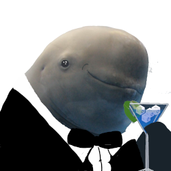
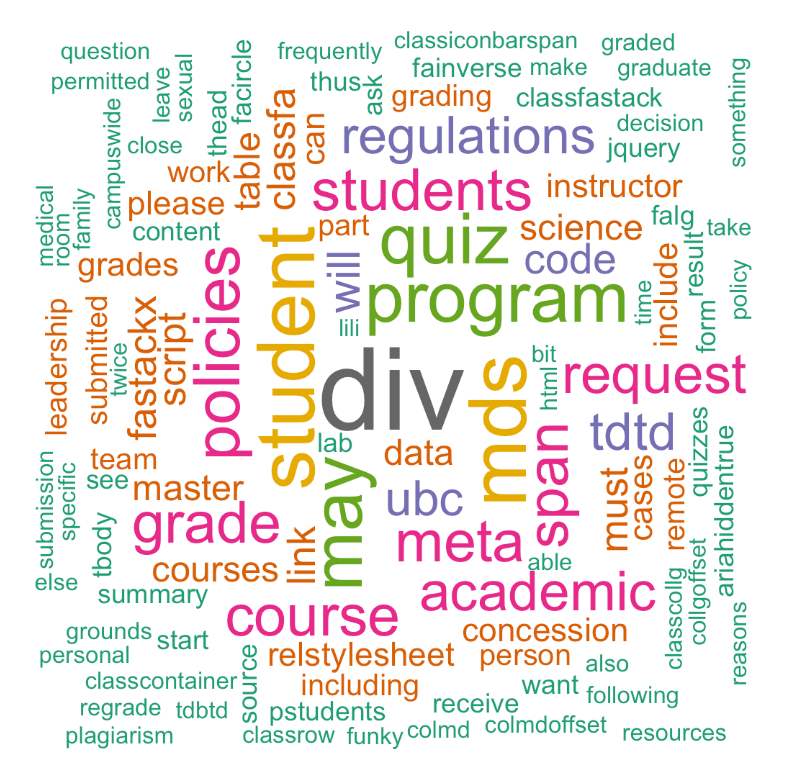

```{r, include = FALSE}
knitr::opts_chunk$set(
  collapse = TRUE,
  comment = "#>"
)
```

This package is designed to demonstrate how basic features of text analysis can be utilized to analyze and represent a text file or string while applying a humorous lens (because what is data science without a dash of humor!). 

This document introduced you to Ranimalsgonewild basic set of tools, and shows you how to apply them to textual data.

## Functions 

Brief introduction:

  - animalClassifier: Determine an animal name based on the input text characters
  
  - animalType: Output an image of the type of the animal based on the text and species
  
  - textTransformer: Modify original text input with random animal name
  
  - wordCloud: Create word cloud based on total word counts
  
## Usage

#### To use Ranimalsgonewild package in a project:

```{r setup}
library(Ranimalsgonewild)
```

#### Identidy animal names with animalClassifier()
`animalClassifier` needs single text input (characters data type)
```{r}
text <- "Premature optimization is the root of all evil"
animalClassifier(text)
```

#### Ouput animal image with animalType()

`animalType` needs two inputs which are the animal name from `animalClassifier` and the same text input.
```{r, echo=FALSE}
species <- "Whale"
animal_img <- animalType(species, text)
```


  
#### Modify the text with textTransformer()

`textTransformer` takes in a text input and modifies it with random animal name
```{r}
text <- "print this line of text"
textTransformer(text)
```

#### Ouput animal image with wordCloud()
`wordCloud` create the image based on a web link which contains textual data
```{r, message=FALSE}
wordCloud("https://ubc-mds.github.io/policies/")
```
{#id .class width=50%}


